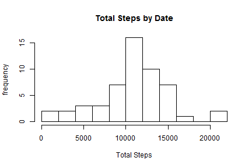
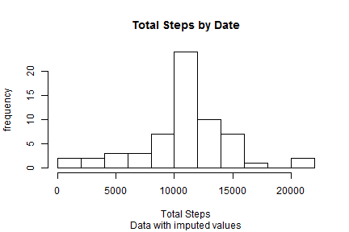
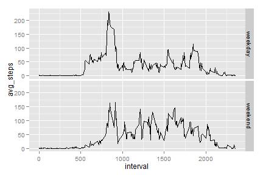

## Loading and preprocessing the data
This script assumes that .zip file with the data for the assignment has been downloaded and the data set in the file "activity.csv" has been extracted to the working directory.


```r
library(plyr)
library(dplyr)
activity.df <- read.csv("activity.csv")
## Make another column in Date format
activity.df$newDate <- as.Date(activity.df$date)

## Create data frame table for easier processing
Activity <- tbl_df(activity.df)
```


## What is mean total number of steps taken per day?

We are interested in the distribution of the number of steps per day, which we can explore by summarizing the steps by the newDate variable in a new data frame.


```r
steps_by_Date <- group_by(Activity, newDate) 
                  
total_steps_by_Date <- summarize(steps_by_Date, total_steps = sum(steps))
```

A histogram of the "total_steps" variable shows the shape of the distribution of total steps by day.


```r
hist(total_steps_by_Date$total_steps, breaks=10, main="Total Steps by Date", 
     xlab="Total Steps", ylab="frequency")
```

 

We also are interested in the mean and median steps per day.


```r
mean_steps <- mean(total_steps_by_Date$total_steps, na.rm=TRUE)
median_steps <- median(total_steps_by_Date$total_steps, na.rm=TRUE)
```


The mean steps per day = 1.0766 &times; 10<sup>4</sup>  
The median steps per day = 10765


## What is the average daily activity pattern?

We will calculate the average number of steps by interval.


```r
steps_by_interval <- group_by(Activity, interval)
avg_steps_by_interval <- summarize(steps_by_interval, avg_steps = mean(steps, na.rm = TRUE))
```

A time series plot of the average steps by interval helps display the acitivity pattern.


```r
with(avg_steps_by_interval, plot(interval, avg_steps, type="l", main="Average Steps by Interval"))
```

 

We are interested in the interval with the greatest average steps.


```r
max_avg_steps <- max(avg_steps_by_interval$avg_steps)

max_interval <- avg_steps_by_interval$interval[ which(avg_steps_by_interval$avg_steps   == max_avg_steps)]
```


The interval with the greatest average number of steps is 835, with 206.1698 steps on average across the days.

## Imputing missing values

The data set has a number of missing values for the "steps" variable. We can count the rows with missing values.


```r
total_missing <- sum(is.na(Activity$steps))
```

There are 2304 rows in the Activity data frame with missing steps values.

I chose to impute values to the missing steps measurements by applying the average number of steps recorded for each interval. Since we have already calculated the average number of steps by interval, it was easy to apply these average values by joining the values in the `avg_steps_by_interval` data frame to the original Activity data frame and then copy these average values to the steps variable in all those rows with missing steps values.


```r
Activity_imputed <- join(Activity, avg_steps_by_interval, by="interval")
Activity_imputed$steps[is.na(Activity_imputed$steps)] <- 
  Activity_imputed$avg_steps[is.na(Activity_imputed$steps)]
```

We are interested again in the steps by date for the data set with imputed values.


```r
steps_by_Date_imp <- group_by(Activity_imputed, newDate) 
                  
total_steps_by_Date_imp <- summarize(steps_by_Date_imp, total_steps = sum(steps))
```

We can produce a histogram that includes the imputed values.


```r
hist(total_steps_by_Date_imp$total_steps, breaks=10, main="Total Steps by Date", 
     xlab="Total Steps", ylab="frequency", sub="Data with imputed values")
```

 

The histogram reveals that the 8 days that were missing steps values have been assigned the average total number of steps per day and now appear in the middle interval of the histogram (first interval above 10,000), making the bar for that inteval taller.

We also are interested in the mean and median steps per day with the imputed values and how those may differ from the original mean and median.


```r
mean_steps_imp <- mean(total_steps_by_Date_imp$total_steps)
median_steps_imp <- median(total_steps_by_Date_imp$total_steps)
```


The mean steps per day with imputed values = 1.0766 &times; 10<sup>4</sup>  
The median steps per day with imputed values = 1.0766 &times; 10<sup>4</sup>

We observe that this method of imputation did not change the mean steps per day and increased the median by just over 1 step per day. (The mean and median with the imputed values are equal.)

## Are there differences in activity patterns between weekdays and weekends?

We can use the weekdays function to identify the day of the week for the newDate variable in the data set with imputed values. We will make a variable "day_type" to designate whether a date is on the weekend or during the week.


```r
Activity_imputed$day_type <- "weekday" ## assign all rows as weekday first
## Use the grepl function together with the weekdays function to assign the value
## "weekend" if the weekdays function returns Saturday or Sunday
Activity_imputed$day_type[grepl("Saturday|Sunday", 
                                weekdays(Activity_imputed$newDate))] <- "weekend"

## Now convert day_type from character into a factor
Activity_imputed$day_type <- factor(Activity_imputed$day_type)
```

A time series plot of the average steps by interval will help show whether the activity level differs between weekdays and weekends. We need to summarize the data with imputed values by the type of day and the interval.


```r
steps_by_interval_imp <- group_by(Activity_imputed, day_type, interval)
avg_steps_by_interval_imp <- summarize(steps_by_interval_imp, 
                                       avg_steps = mean(steps))
```

With the data grouped by the type of day and the interval, we can make line plots that show the activity pattern by interval for the two groups of days.


```r
library(ggplot2)
qplot(interval, avg_steps, data=avg_steps_by_interval_imp, 
      facets = day_type ~ ., geom="line")
```

 

